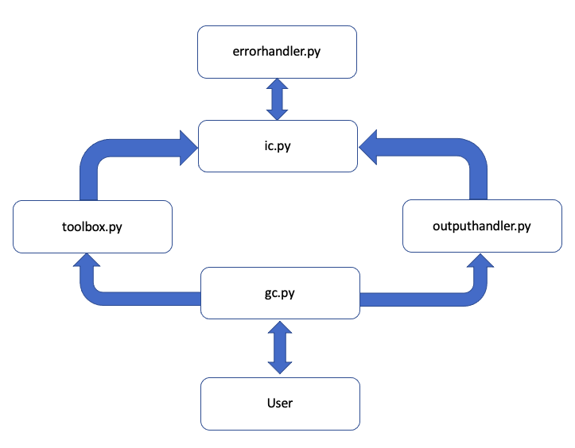

# Project-556
In this project simple VASP workflows will be created to run a Gibbs calculation.

## Goal-1:Coding a single calculation

**Steps towards the goal completion**

1. Identify all the inputs to a optimizeFW for VASP
There are four inputs requireed for the VASP
* Structure (User)
* KPOINTS   (Pymatgen)
* INCAR     (Pymatgen)
* POSCAR    (Pymatgen)
* POTCAR    (From VASP library of POTCARS)
2. Identify and code the Pymatgen inputs
``` python
from pymatgen.io.vasp.inputs import Kpoints
from pymatgen.io.vasp.sets import MPHSERelaxSet, MPRelaxSet, MPStaticSet
```
3. Identify and code the user inputs

## Goal-2:Making the code modular

**Steps towards the goal completion**

1. Develope the code structure in the following format
2. Rerun the previously coded calculation in new framework

**Module dependencies**

